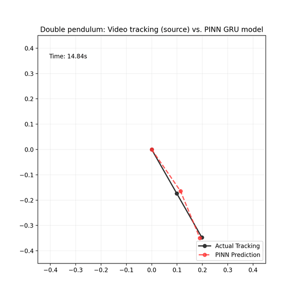

# Double Pendulum PINN (Physics-Informed Neural Network)

A deep learning approach to modeling chaotic systems by enforcing Lagrangian mechanics within a Gated Recurrent Unit (GRU) architecture.



This project implements a Physics-Informed Neural Network (PINN) to predict the trajectory of a double pendulum based on video tracking data. By integrating the Euler-Lagrange equations directly into the loss function, the model learns to respect physical constraints such as energy conservation and rigid-body dynamics, significantly reducing the "drift" common in standard sequence models.

## Tech Stack

* **Core:** Python, PyTorch (Modeling & Autograd)
* **Numerical:** NumPy (Data Processing), SciPy (Signal Analysis)
* **Visualization:** Matplotlib (Real-time Animation & Phase Space plots)
* **Architecture:** Custom Gated Recurrent Unit (GRU)
* **Physics Engine:** Lagrangian Mechanics (Second-order ODE residuals)

## Core Features

* **Physics-Informed Loss:** Combines standard Mean Squared Error (MSE) with a physical penalty term based on the system's Lagrangian: $Loss = MSE + \lambda \cdot L_{physics}$.
* **Custom GRU Architecture:** Hand-implemented GRU cells for granular control over hidden state dynamics and gradient flow.
* **Modular MSE:** Implemented circular topology logic to correctly interpret the $0 = 2\pi$ angular relationship, preventing prediction "snapping" and spinning artifacts.
* **Chaos Management:** Optimized for high-sensitivity dynamical systems, maintaining trajectory integrity through chaotic transitions.
* **Efficient Data Pipeline:** Implemented data striding and downsampling to balance computational speed with high-fidelity physical modeling.

## Technical Challenges Solved

1.  **Exploding Gradients:** Managed the numerical instability caused by dividing by $dt^2$ in the acceleration terms through adaptive loss annealing and gradient norm clipping.
2.  **Coordinate Misalignment:** Synchronized the mathematical Lagrangian reference frame with the real-world video tracking coordinate system.
3.  **Local Minima:** Utilized a multi-stage training strategy (Warm-up -> Physics Refinement) to ensure the model captures the motion profile before enforcing strict physical laws.

## How to Run Locally

### 1. Clone the Repository
```bash
git clone https://github.com/Emwook/double_pendulum.git
cd double-pendulum
```

### 2. Install Dependencies

```bash
pip install -r requirements.txt
```
### 3. Run the Inference Demo
Load the pre-trained 18KB model and visualize the side-by-side comparison between actual tracking and AI prediction.

```bash
python scripts/demo.py
```
### 4. Run Training
To retrain the model or experiment with different physics weights:

```bash
python scripts/training_loop.py
```

## Data Source
The training data for this project consists of high-frequency video tracking coordinates from Myers, Audun; Khasawneh, Firas; Tempelman, Josh; Petrushenko, David  (2020), “Low-cost double pendulum for high-quality data collection with open-source video tracking and analysis”. The raw trajectories were processed and converted from pixel-space to angular coordinates (radians) to fit the Lagrangian reference frame. Link to the source: 

``` bash 
https://data.mendeley.com/datasets/7yd2ntbh3w/1
```

## Future Work

### Energy Conservation: Implementing a Hamiltonian-based loss to further ensure energy symmetry.

### Rocket Pathing: This project serves as a prototype for a larger-scale trajectory prediction system for aerospace applications.
